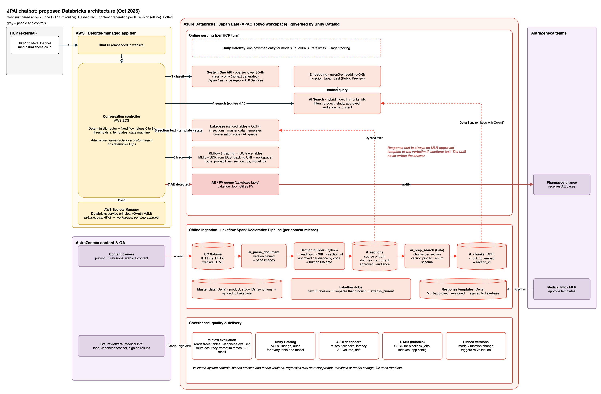

# JPAI chatbot (HCP Q&A router on Databricks)

A chatbot for the AstraZeneca Japan HCP website. Each question is routed by code (using classifier probabilities from
the System One API), and the answer is always an approved template or the **verbatim** text of an Interview Form (IF)
section. Nothing is generated by an LLM.



Routing flow: [`docs/architecture/01-qa-routing-flow.drawio.png`](docs/architecture/01-qa-routing-flow.drawio.png)

Everything installs into **your own Databricks workspace** with one Databricks Asset Bundle (DAB). There are two ways:
**A. one command** (recommended) or **B. step by step**.

---

## 1. Before you start

**On your laptop**
- [Databricks CLI](https://docs.databricks.com/dev-tools/cli/install.html) **1.18 or newer** (`databricks --version`).
  macOS: `brew tap databricks/tap && brew install databricks`. Windows: `winget install Databricks.DatabricksCLI`.
- `python3` and `git`. On Windows run the commands in WSL or Git Bash.

**In the workspace** (ask your workspace admin if unsure)
- Unity Catalog, with a catalog where you have `CREATE SCHEMA` (for example `main`).
- A **serverless SQL warehouse** (you need its id: *SQL Warehouses → your warehouse → Overview*).
- Enabled: serverless jobs and pipelines, Databricks Apps, Lakebase (Postgres), AI Search (Vector Search).
- Model access:
  - `system.ai.openjev-qwen35-4b` (System One API, used for routing).
  - `databricks-qwen3-embedding-0-6b` (embeddings for search).
  - Optional: `databricks-claude-opus-5-5` (evaluation judge only).
  - In regions where a model is not served locally (for example Azure Japan East for System One), the admin must
    enable **cross-geo processing** for the workspace.

**Get the code**
```bash
git clone https://github.com/Praneeth16/jpai-chatbot.git
cd jpai-chatbot
```

---

## 2A. Install with one command (recommended)

```bash
bash scripts/install.sh
```

The script asks three things:

| it asks | what to enter |
|---|---|
| `Databricks workspace URL` | your workspace URL, e.g. `https://adb-1234567890123456.7.azuredatabricks.net`. A browser opens for login the first time. |
| `Catalog` | a catalog from the list it prints (you need `CREATE SCHEMA` on it) |
| `Warehouse id` | a serverless warehouse id from the list it prints |

It shows a summary and asks `Continue? [y/N]`. Then it runs everything, which takes **30–60 minutes** (most of that
is creating the AI Search endpoint and the first index sync). At the end it prints the **app URL**.

No prompts (for CI, or if you already know the values):
```bash
bash scripts/install.sh --host https://<your-workspace> --catalog <catalog> --warehouse-id <warehouse-id> --yes
```
Use `--profile <name>` instead of `--host` if you already have a Databricks CLI profile. Run
`bash scripts/install.sh --help` for all options. The script is safe to re-run.

---

## 2B. Install step by step

Use this to see what every step does, or if the script stops halfway.

**Step 1: log in to your workspace** (opens a browser):
```bash
databricks auth login --host https://<your-workspace> --profile az
```

**Step 2: tell the bundle your catalog and warehouse.** Use the same terminal for all later steps:
```bash
export BUNDLE_VAR_catalog=<catalog>
export BUNDLE_VAR_warehouse_id=<warehouse-id>
databricks bundle validate --profile az      # should end with "Validation OK!"
```

**Step 3: create the folder for the MLflow experiment:**
```bash
databricks workspace mkdirs /Shared/jpai-chatbot --profile az
```

**Step 4: deploy the bundle.** This creates the schema `<catalog>.jpai_chatbot`, the volumes, the Lakebase project,
the AI Search endpoint, the ingestion pipeline, 4 jobs, the MLflow experiment and the app:
```bash
databricks bundle deploy --profile az
```

**Step 5: load the documents.** This copies `data/docs/*.pdf` and the master data, then parses, splits and chunks
the PDFs and publishes the tables (about 10–15 minutes):
```bash
databricks bundle run ingest_job --profile az
```

**Step 6: create the search index and the Lakebase synced tables** (about 20–40 minutes the first time):
```bash
databricks bundle run bootstrap_job --profile az
```

**Step 7: start the app:**
```bash
databricks bundle run chatbot --profile az
```

**Step 8: give the app its permissions.** Run bootstrap again now that the app exists; it is quick this time:
```bash
databricks bundle run bootstrap_job --profile az
```

**Step 9: get the app URL:**
```bash
databricks apps get jpai-chatbot --profile az
```

---

## 3. Check that it works

1. Open the app URL. The first time, Databricks asks you to authorise the app (**Authorize as …**). Click your name.
2. Open `<app-url>/api/v1/health`. Every check should be `true`.
3. Try these in the chat (Japanese UI, with an English toggle):
   - `イジュドの貯法を教えてください` → verbatim IF section Ⅹ.3, with the citation and page
   - `HIMALAYA試験の全生存期間の結果を教えて` → clinical study section (Ⅴ.5)
   - `イジュドを投与した患者さんに発疹が出ました` → adverse-event template, and the case is queued for PV
   - `今日の東京の天気は？` → out-of-scope template
4. The **Ops** page shows the route mix, the AE queue and recent turns. **Sources** lists the indexed documents.

---

## 4. Everyday tasks

| task | how |
|---|---|
| Add or update an IF PDF | In the app: **Sources → Upload** (admins). Or copy it to `data/docs/`, then `databricks bundle deploy --profile az` and `databricks bundle run ingest_job --profile az`. A new product needs rows in `data/reference/products.csv`, `studies.csv` and `synonyms.csv` first. |
| Change template wording | Edit `data/reference/templates.csv`, then `bundle deploy` and `bundle run ingest_job`. The templates are **placeholders** until AZ Medical / Legal / Regulatory approve them. |
| Change routing thresholds | Set the `ROUTER_CONFIG` env var of the app (JSON, keys in `app/server/router/config.ts`), then `databricks bundle deploy`. |
| Deploy code changes | `databricks bundle deploy --profile az` |
| Turn on PV e-mails | Unpause `jpai ae notifier` and add an e-mail notification (see `docs/RUNBOOK.md`). |
| Run the evaluation | See `src/eval/README.md` (runs from a laptop with your login). |
| Uninstall | `databricks bundle destroy --profile az`. See `docs/RUNBOOK.md` for the index and synced tables. |

If you used `install.sh`, the catalog and warehouse are saved in `.databricks/bundle/az/variable-overrides.json`,
so these commands only need `--profile`. The profile `install.sh` created is printed at the start of its output.

If something fails, see **Troubleshooting** in [`docs/RUNBOOK.md`](docs/RUNBOOK.md).

---

## 5. What gets created

| component | name (default prefix `jpai`) |
|---|---|
| UC schema with tables, volumes, index | `<catalog>.jpai_chatbot` (`docs` and `page_images` volumes, `if_chunks_idx` index) |
| Lakebase synced tables (UC) | `<catalog>.jpai_chatbot_ref` |
| Lakebase project (Postgres) | `jpai-chatbot` (app schema `app`: conversation state, turn log, AE queue) |
| AI Search endpoint | `jpai-chatbot-search` |
| Pipeline and jobs | `jpai ingest`, `jpai bootstrap`, `jpai ae notifier`, `jpai eval` |
| MLflow experiment (traces in UC) | `/Shared/jpai-chatbot/traces` |
| App | `jpai-chatbot` |

To change names, override the variables in `databricks.yml` (`prefix`, `schema`, `synced_schema`, `lakebase_project_id`,
`ai_search_endpoint`), for example `export BUNDLE_VAR_schema=my_schema`.

---

## 6. How it works

| step | Databricks component |
|---|---|
| PDF → parsed elements and page images | `ai_parse_document` in a serverless Lakeflow pipeline (`src/ingest`) |
| elements → IF sections (heading hierarchy, verbatim text) | section builder (Python, unit-tested) |
| sections → search chunks | `ai_prep_search` per section |
| chunks → hybrid search index | AI Search Delta Sync index, `databricks-qwen3-embedding-0-6b` |
| master data, templates and sections for the app | Lakebase synced tables |
| one classification call per turn (AE, injection, request, conditions, small talk, intent) | System One API |
| routing, retrieval, answer, AE queue, conversation state | Databricks App (AppKit, TypeScript) + Lakebase |
| traces | MLflow experiment with a Unity Catalog trace location |
| hand-off to pharmacovigilance | `ae_notifier_job` → `pv_cases` table |

The router is API-first: the UI is one client of `POST /api/v1/route`, the same contract an external controller (for
example on AWS ECS) would call. See [`docs/API.md`](docs/API.md).

More detail:
- [`docs/CONTRACTS.md`](docs/CONTRACTS.md): names, schemas, routing rules and every design decision.
- [`docs/RUNBOOK.md`](docs/RUNBOOK.md): operations and troubleshooting.
- [`src/eval/README.md`](src/eval/README.md): evaluation.

## 7. Evaluation results (103 labelled questions, JD0300 + IMFINZI IFs, live app)
| metric | first run | current | target |
|---|---|---|---|
| route accuracy | 62.1% | 96.1% | ≥ 90% |
| AE recall (AE answer + queued) | 100% | 100% | 100% |
| AE false positive (question answered with the AE template) | 8.5% | 0% | |
| section hit (right IF section) | 22.0% | 86.0% | ≥ 80% |
| verbatim exact / template only | 100% / 100% | 100% / 100% | 100% |
| latency p50 / p95 | 1.8 s / 2.5 s | 1.7 s / 2.6 s | |

Open points for AZ:
- Template wording must be approved.
- The adverse-event review band (`tau_ae` 0.35 to `tau_ae_route` 0.8) is a pharmacovigilance policy decision.
- English questions get the Japanese IF text verbatim, because nothing is translated.
